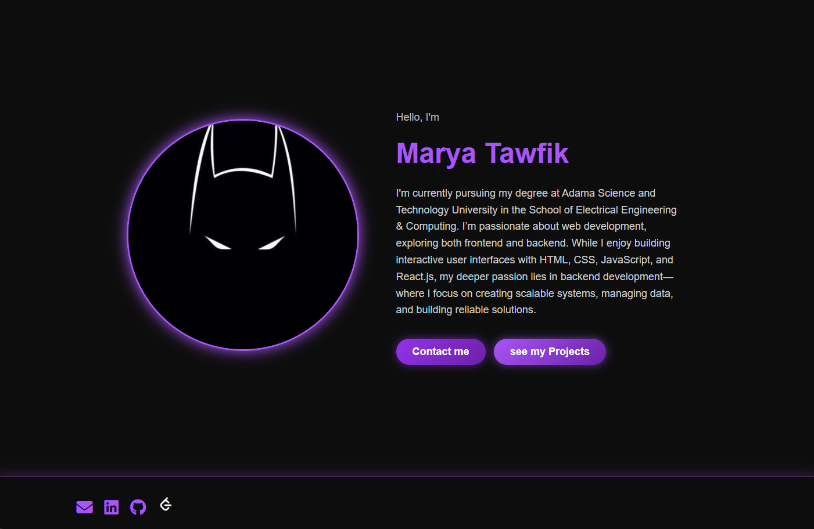
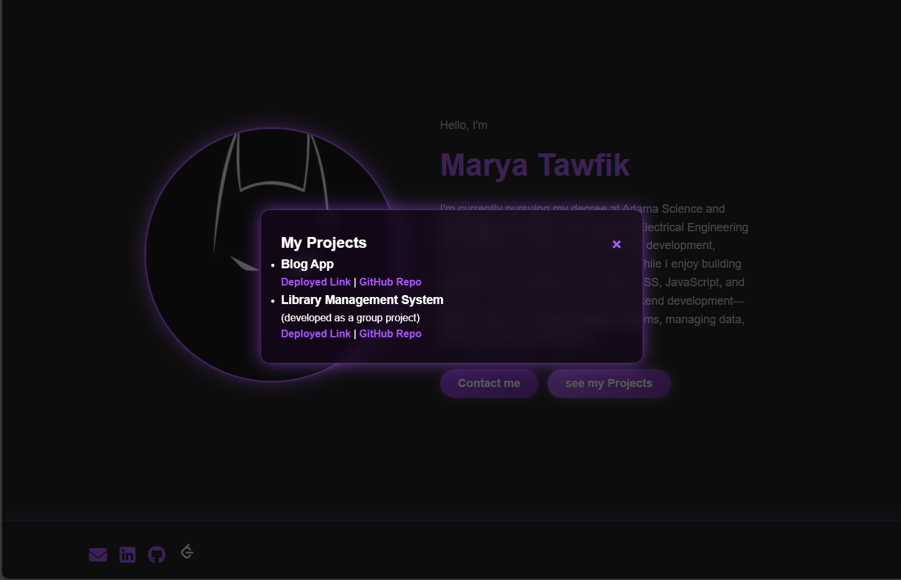
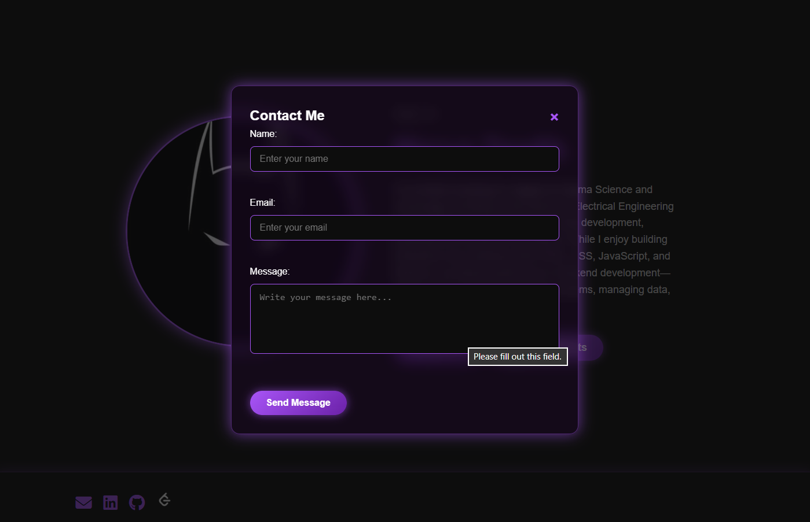

# Marya Tawfik | Portfolio

This is my personal portfolio website showcasing my background, skills, and projects in web development.  
It highlights both my frontend and backend work, with a focus on building scalable systems and interactive user experiences.

## 🛠️ Built With
- **HTML5** – structure and semantic markup  
- **CSS3** – styling, gradients, glassmorphism, responsive design  
- **JavaScript (ES6)** – interactivity, modal popups  
- **Font Awesome & SVG** – icons for social links
## 📸 Screenshots

## 📬 Contact
You can reach me at:  
- 📧 Email: [mariyatawfik6@gmail.com] 
- 💼 LinkedIn: [linkedin.com/in/marya-tawfik] 
- 🐙 GitHub: [github.com/MaryaTawfik]  
- 💡 LeetCode: [leetcode.com/u/gAeoNavwKy]

## 💡 Future Improvements
- Add backend integration for the contact form  
- Showcase more backend-focused projects  
- Include animations and transitions for smoother UX  

## 🧑‍💻 About Me
I’m Marya Tawfik, a student at **Adama Science and Technology University** in the School of Electrical Engineering & Computing.  
I’m passionate about backend development, but I also enjoy creating interactive frontend experiences.  
This portfolio reflects my journey, my skills, and my commitment to continuous learning.
